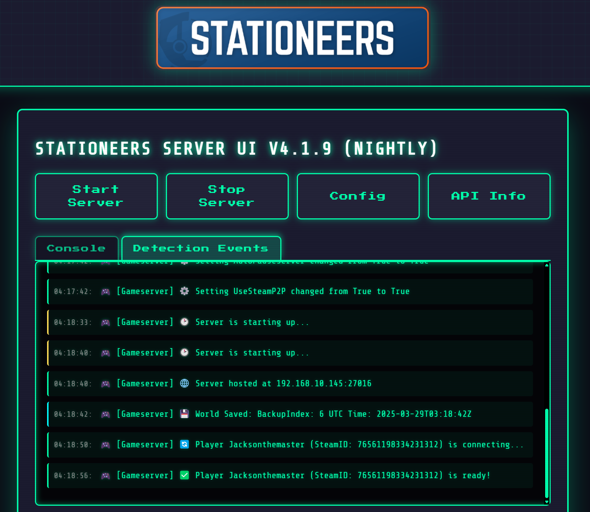

# Stationeers Server UI

### 🌟 Live UI Preview 🌟

This branch is used for deployment of the github pages site for the project, which is hosted at https://steamserverui.github.io/StationeersServerUI/. 
It includes download buttons and a live preview of the UI.

The preview is slightly outdated, but it's the best way to see the UI in action without the need to install it yourself.

  
  
  <em>Manage your Stationeers server with style - Retro interface, modern capabilities.</em>

For comprehensive instructions, examples, and more details, visit our [GitHub Wiki](https://github.com/SteamServerUI/StationeersServerUI/wiki).

| Documentation Section | Description |
|----------------------|-------------|
| [Features](https://github.com/SteamServerUI/StationeersServerUI/wiki/Features) | Complete list of features and capabilities |
| [Requirements](https://github.com/SteamServerUI/StationeersServerUI/wiki/Requirements) | System requirements and prerequisites |
| [Installation](https://github.com/SteamServerUI/StationeersServerUI/wiki/Installation) | Step-by-step installation guide |
| [First-Time Setup](https://github.com/SteamServerUI/StationeersServerUI/wiki/First-Time-Setup) | Getting your server up and running |
| [Discord Integration](https://github.com/SteamServerUI/StationeersServerUI/wiki/Discord-Integration) | Setting up and using Discord features |
| [Web Interface](https://github.com/SteamServerUI/StationeersServerUI/wiki/Web-Interface) | Using the web UI effectively |
| [Docker Guide](https://github.com/SteamServerUI/StationeersServerUI/wiki/Docker-Guide) | Running in Docker containers |
| [Security Considerations](https://github.com/SteamServerUI/StationeersServerUI/wiki/Security-Considerations) | Important security best practices |

## License

This project is licensed under the STATIONEERS SERVER UI LICENSE AGREEMENT - see the [LICENSE](LICENSE) file for details.

