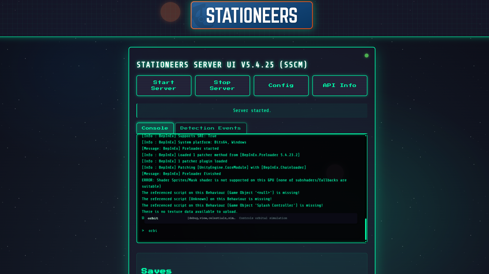
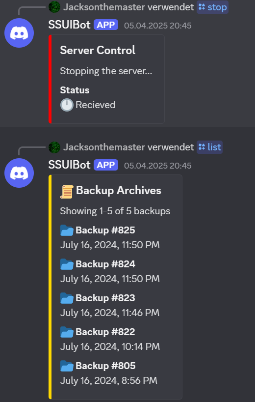

> [!IMPORTANT]
> This project is licensed under the SSUI [LICENSE](LICENSE) and does NOT allow redistribution.
> Instead of forking, join the [Discord](https://discord.gg/8n3vN92MyJ) and state your intentions or [Open an issue](https://github.com/SteamServerUI/SteamServerUI/issues).

# Stationeers Server UI

Managing a Stationeers dedicated server shouldn't require a PhD in Linux or hours of config editing and wiki reading. SSUI gives you a powerful web interface, automated backups, Discord integration, and professional server management - all from a single executable. No drama, just a working server. In minutes.

## ✨ Feature Showcase ✨

| 🚀 Easy Setup | Secure by Default | 🔄 Auto Updates | 🎮 Easy Control | 💾 Smart Backups | 🤖 Discord Bot | 🛠️ Command Manager | 🧩 Mod Support | 
|:-------------:|:-----------------:|:---------------:|:----------------:|:----------------:|:--------------:|:------------------:|:-------------:|
| Just run and go | JWT auth, TLS | Gameserver updates at startup | One-click management | Automated system | Remote control | Execute server commands | BepInEx integration |

### 🌟 This is a WebUi, you don't need a graphical OS to run this 🌟

  
  
  <em>Manage your Stationeers server with style - Retro interface, modern capabilities.</em>

## TL;DR - Get Started Fast

📚 Visit the [Quick-Start-Guide](https://github.com/SteamServerUI/StationeersServerUI/wiki/Quick-Start-Guide) in the [Wiki](https://github.com/JacksonTheMaster/StationeersServerUI/wiki)
⛓️‍💥 Follow the chained pages (links at bottom of page)!
📖 Full Documentation is provided in the [Wiki](https://github.com/JacksonTheMaster/StationeersServerUI/wiki).

## What is This?

A sleek, retro-themed web UI to manage your Stationeers dedicated server. No more command line headaches or manual file editing!

### Why You'll Love It

- 🚀 **Zero Config Setup** - Place in empty folder and run
- 🔌 **Auto SteamCMD Setup** - No manual installation required
- 🔄 **Auto Updates** - Server and Management UI update automatically at startup
- 🎮 **One-Click Controls** - Start/stop server or restore backups with simple buttons
- 💾 **Smart Backups** - Automated backup system with easy restore
- 🤖 **Discord Integration** - Control your server through Discord
- 🔒 **Secure by Default** - JWT auth & TLS
- 🛠️ **Command Manager** - Execute server commands directly from the UI or from Discord commands
- 🧩 **Mod Support** - Support for BepInEx mods
- 📦 **Docker Support** - Runs in Docker containers
- 🛠️ **Stationeers Server Command Manager** - Execute server commands directly through the UI, API, or Discord commands
- 🧩 **BepInEx Integration** - Automatic setup of the popular modding framework

## Detailed Documentation

For comprehensive instructions, examples, and more details, visit our [GitHub Wiki](https://github.com/JacksonTheMaster/StationeersServerUI/wiki).

| Documentation Section | Description |
|----------------------|-------------|
| [Features](https://github.com/JacksonTheMaster/StationeersServerUI/wiki/Features) | near-complete list of features and capabilities |
| [Requirements](https://github.com/JacksonTheMaster/StationeersServerUI/wiki/Requirements) | System requirements and prerequisites |
| [Installation](https://github.com/JacksonTheMaster/StationeersServerUI/wiki/Installation) | Step-by-step installation guide |
| [First-Time Setup](https://github.com/JacksonTheMaster/StationeersServerUI/wiki/First-Time-Setup) | Getting your server up and running |
| [Discord Integration](https://github.com/JacksonTheMaster/StationeersServerUI/wiki/Discord-Integration) | Setting up and using Discord features |
| [Web Interface](https://github.com/JacksonTheMaster/StationeersServerUI/wiki/Web-Interface) | Using the web UI effectively |
| [Docker Guide](https://github.com/JacksonTheMaster/StationeersServerUI/wiki/Docker-Guide) | Running in Docker containers |
| [Security Considerations](https://github.com/JacksonTheMaster/StationeersServerUI/wiki/Security-Considerations) | Important security best practices |

## Web UI Preview

_Click the images to expand them._

| UI Overview | Configuration | Backup Management |
|:-----------:|:-------------:|:-----------------:|
|  |  |  |

## Discord Preview

_Click the images to expand them._

| Connection Log | Save Log | Panel | Discord Commands |
|:-----------:|:-------------:|:-----------------:|:-------------:|
|  |  |  |  |

## Contributing

Love this project? I'd love your help making it better! See the [Contributing Guidelines](https://github.com/JacksonTheMaster/StationeersServerUI/wiki/Contributing) to get started.

- 🐛 **Found a bug?** [Open an issue](https://github.com/JacksonTheMaster/StationeesServerUI/issues)
- 💡 **Have an idea?** [Suggest a feature](https://github.com/JacksonTheMaster/StationeesServerUI/issues/new?labels=enhancement)
- 🤔 **Questions?** [Check the Wiki](https://github.com/JacksonTheMaster/StationeesServerUI/wiki) or [open a topic](https://github.com/JacksonTheMaster/StationeesServerUI/issues/new?labels=question).

## License

This project is licensed under the STATIONEERS SERVER UI LICENSE AGREEMENT - see the [LICENSE](LICENSE) file for details.
