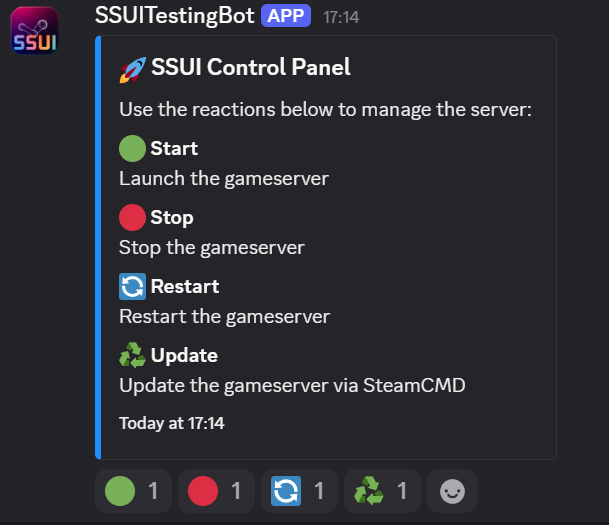

# Stationeers Dedicated Server Control

### ✨ Feature Showcase ✨

| 🚀 Easy Setup | 🔄 Auto Updates | 🎮 Easy Control | 💾 Smart Backups | 🤖 Discord Bot |
|:-------------:|:---------------:|:---------------:|:----------------:|:--------------:|
| Just run and go | Gameserver updates at startup | One-click management | Automated system | Remote control |

  
  <em>Manage your Stationeers server with style - Retro interface, modern capabilities.</em>

## TL;DR - Get Started Fast

1. 📦 Download latest release from [here](https://github.com/JacksonTheMaster/StationeersServerUI/releases)
2. 📁 Place in empty folder and run it
3. 🌐 Access UI at `http://localhost:8080`
4. 📚 See [First-Time Setup](https://github.com/JacksonTheMaster/StationeersServerUI/wiki/First-Time-Setup) in the wiki

## What is This?

A sleek, retro-themed web UI to manage your Stationeers dedicated server. No more command line headaches or manual file editing!

### Why You'll Love It

- 🚀 **Zero Config Setup** - Place in empty folder and run
- 🔄 **Auto Updates** - Server updates automatically at startup
- 🎮 **One-Click Controls** - Start/stop server with simple buttons
- 💾 **Smart Backups** - Automated backup system with easy restore
- 🤖 **Discord Integration** - Control your server through Discord
- 🔌 **Auto SteamCMD Setup** - No manual installation required

## Detailed Documentation

For comprehensive instructions, examples, and more details, visit our [GitHub Wiki](https://github.com/JacksonTheMaster/StationeersServerUI/wiki).

| Documentation Section | Description |
|----------------------|-------------|
| [Features](https://github.com/JacksonTheMaster/StationeersServerUI/wiki/Features) | Complete list of features and capabilities |
| [Requirements](https://github.com/JacksonTheMaster/StationeersServerUI/wiki/Requirements) | System requirements and prerequisites |
| [Installation](https://github.com/JacksonTheMaster/StationeersServerUI/wiki/Installation) | Step-by-step installation guide |
| [First-Time Setup](https://github.com/JacksonTheMaster/StationeersServerUI/wiki/First-Time-Setup) | Getting your server up and running |
| [Discord Integration](https://github.com/JacksonTheMaster/StationeersServerUI/wiki/Discord-Integration) | Setting up and using Discord features |
| [Web Interface](https://github.com/JacksonTheMaster/StationeersServerUI/wiki/Web-Interface) | Using the web UI effectively |
| [Docker Guide](https://github.com/JacksonTheMaster/StationeersServerUI/wiki/Docker-Guide) | Running in Docker containers |
| [Security Considerations](https://github.com/JacksonTheMaster/StationeersServerUI/wiki/Security-Considerations) | Important security best practices |

## Web UI Preview

_The Images below are from the 2.2 release, I will update them eventually. Minor changes have been made to the UI since. The font has partly been changed to a more readable one, and buttons have been renamed. The config pages got cleanups too._

| UI Overview | Configuration | Backup Management |
|:-----------:|:-------------:|:-----------------:|
|  |  |  |

## Discord Preview

| Connection Log | Save Log | Panel | Discord Commands |
|:-----------:|:-------------:|:-----------------:|:-------------:|
|  |  |  |  |

## Important Security Note

⚠️ **For security reasons, do not expose this UI directly to the internet without proper authentication.**

See [Security Considerations](https://github.com/JacksonTheMaster/StationeersServerUI/wiki/Security-Considerations) for more details.

## Linux Support (March 2025)

While this software now proudly supports Linux, please note that the Stationeers Server Linux builds are currently experiencing issues. Stable branch has startup problems, and beta launches but fails on save loading. We're monitoring the situation with RocketWerkZ and will update when resolved.

## Contributing

Love this project? I'd love your help making it better! See the [Contributing Guidelines](https://github.com/JacksonTheMaster/StationeersServerUI/wiki/Contributing) to get started.

- 🐛 **Found a bug?** [Open an issue](https://github.com/JacksonTheMaster/StationeesServerUI/issues)
- 💡 **Have an idea?** [Suggest a feature](https://github.com/JacksonTheMaster/StationeesServerUI/issues/new?labels=enhancement)
- 🤔 **Questions?** [Check the Wiki](https://github.com/JacksonTheMaster/StationeesServerUI/wiki) or [open a topic](https://github.com/JacksonTheMaster/StationeesServerUI/issues/new?labels=question).

## License

This project is licensed under the MIT License - see the [LICENSE](LICENSE) file for details.